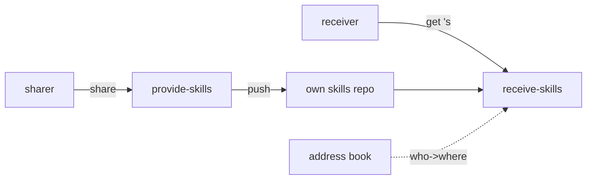
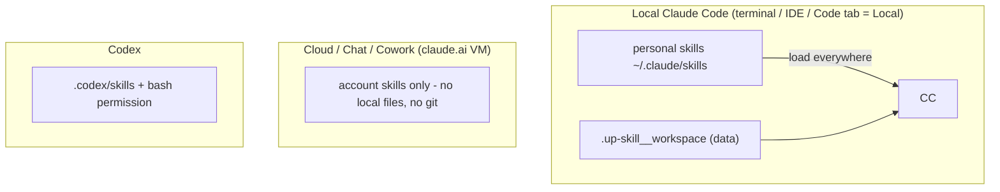
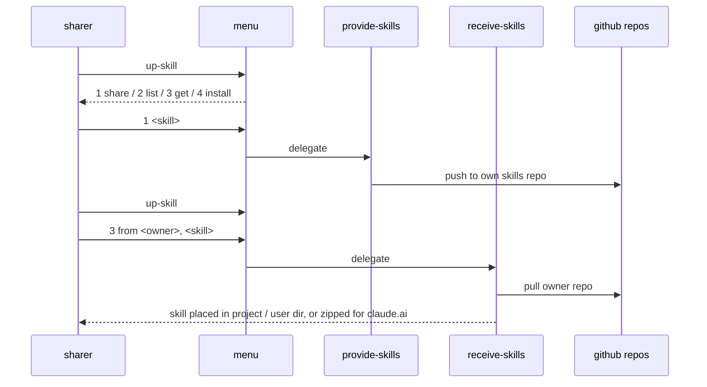
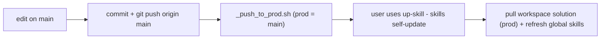

# up-skill - sharing solution (level 2)

A way for non-technical people to share Claude Code skills with teammates over github.



## Model

| Concept | Definition |
|---|---|
| Skill | a folder with `SKILL.md` (+ its own scripts) |
| Skills repo | per-member github repo of shared skills: `up-skill__skills_repo__<member>` |
| Address book | per-team github repo: `address_book.json` maps member name -> `{folder, repo}` |
| Solution repo | `mingzilla/up-skill` - installers + the skills + l2 one-off setups |
| Workspace | hidden, per-machine data folder: `.up-skill__workspace` (data only, skills are global) |
| Provide | publish one chosen skill to your own skills repo |
| Receive | list / get / install a skill into a target (local dir, or zip for claude.ai) |

## Solution tree

```text
mingzilla/up-skill                       the solution repo
├── README.md
├── up-skill__install.sh                 entry installer  (curl | bash, linux/mac/wsl)
├── up-skill__install.ps1                entry installer  (irm | iex, windows)
├── up-skill__uninstall.sh / .ps1
├── _push_to_prod.sh                     release: main -> prod
└── _system/
    └── l2_share_skills/                 level-2 bundle (own skills + one-offs)
        ├── design.md
        └── .claude/
            ├── skills/
            │   ├── up-skill__menu/                  numbered options -> delegate
            │   ├── up-skill__sharing__provide-skills/   share (self-contained)
            │   └── up-skill__sharing__receive-skills/   list/add/install (self-contained)
            └── skills__one_off/                     referenced explicitly, never auto-run
                ├── admin__setup__administrator/     superset: team + address book + member repos
                ├── admin__setup__user/              umbrella (non-technical contract)
                ├── admin__setup__user__claude_code/      global install script
                ├── admin__setup__user__claude_desktop_plugin/  plugin assets + marketplace
                └── admin__setup__user__codex/            codex setup

team github repos (per team, public or shared)
├── up-skill__address_book__<team>       e.g. ...__sandbox (public example)
└── up-skill__skills_repo__<member>      one per member (leah / ming / myles)

machine runtime (after install)
├── ~/.up-skill__workspace               data only
│   ├── up-skill/                        solution clone at prod (source anchor)
│   ├── address_books/<team>/            address book + each member skills repo
│   └── up-skill__user-config.json       user / team / address_book
├── ~/.claude/skills/                    global skills (menu, provide, receive)
└── (codex) ~/.codex/skills/             same three, if Codex is used
```

## Runtime surfaces



| Surface | Sees local files | Can run up-skill |
|---|---|---|
| Local Claude Code | yes | yes - the primary target |
| Cloud / Chat / Cowork | no | no (account skills, instruction-only) |
| Codex | sandbox-gated | yes once bash/execute allowed |

Rule: a skill that touches local files must run in **Local** Claude Code; a pure-instruction skill can live anywhere (account skill / repo skill).

## Sharing flow



- Invocation is plain language (`up-skill`), not a slash command. `/` pickers in some surfaces run entries as commands; skills are not commands.
- Numbered menu replies work conversationally (`3 from leah, daily_summary`).

## Workspace location resolution (in each skill's lib)

| Order | Rule |
|---|---|
| 1 | `UP_SKILL_WORKSPACE` env, if set |
| 2 | walk up from cwd for `up-skill__user-config.json` |
| 3 | default `~/.up-skill__workspace` (under the user profile) |

## Install / uninstall

| Tool | Command | Effect |
|---|---|---|
| linux/mac/wsl | `curl -fsSL .../up-skill__install.sh | bash` | rebuild workspace (delete+recreate) + copy global skills to `~/.claude/skills` |
| windows | `irm .../up-skill__install.ps1 | iex` | same, under `%USERPROFILE%` |
| uninstall | `up-skill__uninstall.sh / .ps1` (`--yes` / `-Yes`) | remove global skills + workspace; never repos/projects |
| flags | `--skip-global`, `--branch` (default prod), `--home`/`-Dir` | |

Install always deletes and recreates the whole workspace - never refreshes, so no stale state.

## Release loop



- `main` = working; `prod` = released (what installs clone).
- The user never reruns the installer: on use, the skill pulls the workspace's solution clone
  (`~/.up-skill__workspace/up-skill`, branch prod) and refreshes the global copies - automatic,
  quiet, best-effort (offline runs still work).
- Plugin manifest has no `version` -> plugin updates on push.

## Decisions

| # | Decision | Choice | Why |
|---|---|---|---|
| 1 | Scope of this work | sharing (level 2) only | a curated skill library is a different task (UPS0002, levels 3+) |
| 2 | Skill unit | self-contained folder: `SKILL.md` + own scripts/lib | copy-anywhere; no shared folder; no symlink needed (Windows) |
| 3 | Member repo name | `up-skill__skills_repo__<member>` | frees the `sharing` namespace for skills; reads as a place |
| 4 | Address book | separate team github repo | one variable points at the active team |
| 5 | Workspace role | data only | skills are provided globally, not copied per project |
| 6 | Claude Code delivery | global personal skills in `~/.claude/skills` | load in every local session; "per project is wrong" |
| 7 | Global vs per-project | global by default | non-technical users expect it to work everywhere |
| 8 | Workspace discovery | env -> walk-up -> default `~/.up-skill__workspace` | a skill always knows where the data is |
| 9 | Install behaviour | always delete + recreate the workspace | no stale or partial state |
| 10 | Code location | bundled under `_system/l2_share_skills/.claude` | each level (l3...) owns its own skills + one-offs, no cross-level refactor |
| 11 | Setup skills | per tool, under `skills__one_off` | referenced explicitly once; never auto-detected at runtime |
| 12 | Menu | a `up-skill__menu` skill delegating to provide/receive | numbered options; conversation continues naturally |
| 13 | Desktop (windows) | plugin package + marketplace | Code-tab local sessions; WSL sessions in Desktop do not load plugins |
| 14 | Codex | copy skills to `~/.codex/skills` + allow bash/execute | Codex sandbox denies bash by default; must be permitted |
| 15 | Chat / Cowork | claude.ai account skills (zip upload) | cloud surfaces have no local files; instruction-only skills |
| 16 | OS | bash for linux/mac/wsl; powershell mirror for windows | `.sh` cannot run natively on Windows |
| 17 | Release | `prod` branch = released; `_push_to_prod.sh` | users only ever receive what works |
| 18 | Updates | self-update on use (pull prod, refresh global skills) | the user never reruns an installer |

## Open items

| Item | Status |
|---|---|
| `admin__setup__user__codex` detail (bash-permission step) | to document in the skill |
| Claude Desktop plugin install exercised on a real Windows local session | pending test |
| zip-to-claude.ai "get for account" variant of receive | pending build |
| skill duplication (l2 `.claude/skills` vs plugin assets) single-source cleanup | pending |
| journey map l1 / l3 / l4 / l5 | separate bundles later (UPS0002 territory for l3) |
